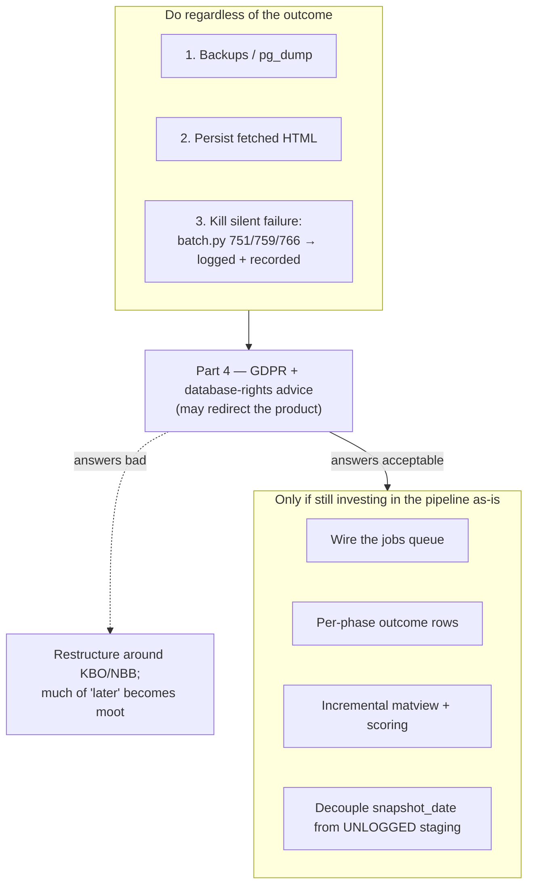

# Rebuild lessons

*Written 2026-07-31. A retrospective, not a decision record — it proposes options rather than
choosing between them. Nothing here has been implemented.*

The question was "what would I do differently rebuilding this from scratch?", asked in the same
breath as "I want to sell this program." Those two facts together change the answer.

**The recommendation is not a rewrite.** The system works. It holds observations that cost real
WAF budget to acquire and cannot be cheaply re-fetched, and it carries months of tuning against a
host that actively resists being scraped. Throwing that away to rebuild the same architecture with
better names would be a bad trade. What follows is what a week of failures actually taught, ordered
by leverage, plus two commercial risks that a purely technical retrospective would miss entirely.

Repo claims below were checked against `master` @ `2de10a4`. A few figures come from the live
database and the local Windows machine and are labelled as such — they were measured in late July
2026 and are not re-verifiable from a fresh clone.

---

## Part 1 — What to keep

These are load-bearing and correct. Don't re-litigate them in any rebuild:

- **Append-only `observations` with provenance.** Every value carries `source`, `confidence`,
  `observed_at`, `run_id`. Conflicting sources coexist instead of overwriting each other. This is
  the single best decision in the codebase — it is why a bad scrape degrades data quality rather
  than destroying it.
- **Validated allowlists** for `source` and `field` (`db/sources.py`, `db/fields.py`). Typos become
  exceptions at insert time instead of silently forking the dataset into `"kbopub"` and
  `"kbopub_html"`.
- **Derived state is rebuildable from facts.** `companies_current` and `prospect_scores` are
  recomputable at any time. When scoring is wrong, you fix the formula and re-run — you never
  migrate data.
- **`parser.py → transformer.py → ingester.py`.** Parsing is pure and testable against golden
  files, independent of network and database.
- **Per-source knowledge in `.claude/skills/`** rather than one enormous context file.

---

## Part 2 — The one failure mode that mattered

Four separate failures in a week. They look unrelated. They are the same bug:

> **The system reported success while doing nothing.**

| Failure | Symptom | Root cause | Where |
|---|---|---|---|
| Export path | Exports written to a path nobody looked at | `$PSScriptRoot` evaluated in a `param()` default | local machine |
| Phase D/E/F | Nights of stale scores, no error anywhere | `with suppress(Exception)` | `pipeline/batch.py:751, 759, 766` |
| Nightly wrapper | Exit code 1 on a completely clean run | `NativeCommandError` under `EAP=Stop` | local machine |
| `kbo_stage_*` wiped | Would have silently killed the next night's run | `UNLOGGED` + unclean Postgres restart | `db/migrations/007_kbo_stage_optim.sql:14-18` |

Not one of these was a logic error. Every one was a **reporting** error: work didn't happen, and
nothing said so.

### The linter was never going to catch this

The obvious lesson — "you had a lint rule for bare `except: pass` and tolerated violations" — is
wrong, and the truth is more useful.

`batch.py` uses `with suppress(Exception)`. That is precisely the form ruff's SIM105 **tells you to
write**. Ruff reports zero violations there. The two `S110`/`SIM105` findings in `src/` are in
`orchestrator.py:664` and `:670` — an unrelated orphaned-`run_log` cleanup, not the outage.

So: **silently swallowing an exception is not a lint problem, and no linter will catch the next
one.** The rule can only see syntax; it cannot see that discarding this particular exception means
three hours of scraping produce no score update.

What makes it sharper is that the correct pattern was already in the file. Phase C2, seven lines
above Phase D, does exactly the right thing:

```python
except Exception as exc:
    report.sources_failed["ddg_brave"] = str(exc)
    log.error("phase_c2_failed", error=str(exc))
```

`report.sources_failed` was in scope. Phases D, E and F just didn't use it.

### Green tests proved nothing

The suite passed and coverage held while Phase F was dead for multiple nights. Coverage counts
lines executed, not failures handled — and `suppress` makes a failed phase byte-for-byte
indistinguishable from a successful one at every layer above it. A test asserting "Phase F ran"
would have passed too. The assertion that was missing is "Phase F *succeeded*, and if it didn't,
something outside this process finds out."

---

## Part 3 — Engineering changes, by leverage

### 1. Never discard a fetched page

`goudengids/fetcher.py:196` returns `ListingPage(url, html, cards_found, is_last_page)`. The HTML is
handed to `ingester.py:138`, re-parsed in memory, and dropped. Nothing persists it.

WAF budget is the scarcest resource in the whole system — it is the reason for the pauses, the
concurrency-1 rule, the 30-day dedup window. And yet a parser bug found the next morning costs an
entire night of re-fetching to fix.

Persist raw responses keyed by `(source, url, fetched_at)`. Re-parsing becomes free and offline.
Small change; largest payoff on this list. It also makes golden-sample collection a byproduct of
normal operation instead of a manual chore.

### 2. Wire up the queue that already exists

`db/repositories/jobs.py::pop_pending()` implements `SELECT … FOR UPDATE SKIP LOCKED`. It is
exported from `repositories/__init__.py`. Its only consumers are
`tests/integration/db/test_jobs_repo.py` — **zero production callers.**

ADR 0001 named this pattern as a reason to drop SQLite and go Postgres-only. It was built, tested,
and then never used. Meanwhile `run_batch` (`batch.py:481-805`, ~325 lines) hand-rolls phase
sequencing in nested closures.

A queue would give, for free, the things the phase structure makes hard:
- **Crash resume.** A killed run resumes from unclaimed jobs instead of restarting the night.
- **Natural WAF chunking.** Lease fewer jobs instead of tuning sleeps inside a loop.
- **Observability.** "What is the pipeline doing?" becomes a query against a table, not a log grep.

### 3. Make "did last night work?" a single SQL query

Today that question is answered by reading logs. It should be one row per **phase** per run:
`(run_id, phase, status, counts, error)`.

`pipeline_progress` cannot serve this. Its primary key is `run_id`
(`005_pipeline_progress.sql:6`) — one upserted row per run, live telemetry that overwrites itself
as the run advances. It is a progress bar, not an audit trail, and it was designed that way
deliberately. A phase-outcome table is a different thing and needs to exist alongside it.

This is the direct structural fix for Part 2. With it, Phase F failing for three nights is a row
with `status='failed'`, not silence.

### 4. Incremental derived state

Phase E rebuilds `companies_current` in full and Phase F rescores every company, after a run that
may have touched a few hundred placeholders. On the live database (~17.2M observations, ~1.96M
`companies_current` rows, measured locally in late July 2026) the matview refresh alone runs about
two minutes.

Scope both to a dirty set — the KBOs touched by this run. This is also the most likely cure for the
still-unidentified Phase F failure: less work, less memory, fewer ways to fall over.

### 5. Don't let deliberately-disposable data become a hard dependency

`kbo_stage_*` are `UNLOGGED` on purpose — that is what makes the bulk COPY fast, and the migration
comment is explicit that they are transient and re-stageable. That trade-off is fine.

What isn't fine: `run_batch` resolves `snapshot_date` from those tables at `batch.py:507-510` and
raises `RuntimeError` if they're empty — **before** the `config.do_kbo_dump` gate at line 549. So
`--skip-kbo-dump` does not skip the dependency. One unclean Postgres restart turns into a hard
failure of the next night's run, including the sources that never needed staging data at all.

Either resolve `snapshot_date` from a durable table, or move the check inside the gate that claims
to control it.

### 6. Configuration belongs in the repo

The `-Limit 15 → 10` change lives in Windows Task Scheduler. It is outside version control,
invisible to `git log`, and lost if the machine is rebuilt. Anything that changes what the pipeline
does is code.

### 7. Get orchestration off PowerShell 5.1

Two of the four failures were PowerShell 5.1 semantics — `param()` default evaluation order, and
`NativeCommandError` from stderr output under `ErrorActionPreference = 'Stop'`. Neither is a bug in
this project's logic. A container entrypoint or a systemd timer removes the whole class.

### 8. Backups

One volume, one machine, zero dumps, no dump tooling anywhere in the repo. Re-scraping is not a
recovery plan when the primary source blocks on volume — that is the one thing this system knows
for certain about its own environment.

---

## Part 4 — What selling it changes

Two risks larger than anything in Part 3. **This is not legal advice**; both need real advice before
money changes hands. Private lead-gen and a sold product are different legal postures, and the
change is the point.

### GDPR versus append-only

Belgian sole traders are natural persons. Their phone numbers and email addresses are personal
data, not company data. Article 17 gives them an erasure right — and the core invariant of this
schema is that observations are never deleted or updated. Article 14 separately requires informing
people whose data you collected from third parties rather than from them.

Today the system has no suppression list, no deletion path, and no distinction between a legal
person and a natural person. The append-only design is right for data integrity and directly in
tension with an obligation that becomes concrete the moment you sell the output.

This is solvable — a suppression table consulted at export, a tombstone mechanism, a
natural-person flag derived from legal form — but it is design work that has not been done.

### Database rights on goudengids

The EU *sui generis* database right (Directive 96/9/EC) protects substantial extraction from a
database that took substantial investment to assemble. A commercial business directory is the
textbook case. Extracting substantially from one, past a WAF that is actively refusing you, to
build a product you then sell, is a materially different risk profile than doing it for your own
prospecting.

### The strategic consequence — and it's good news

The legitimate sources are the strong ones. KBO Open Data is licensed for commercial reuse. NBB
CBSO filings are public by law. Website enrichment of a company's own public site is defensible.

goudengids is simultaneously the **weakest asset legally** and the **cause of nearly every
operational headache**: the WAF, the concurrency-1 constraint, the Imperva challenge pages, the
blocked-sector retries, the placeholder-KBO scheme, and the entire fuzzy-matching consolidation
pass (`pipeline/consolidate.py`, 326 lines) which exists *only* because goudengids listings have no
KBO number.

Making goudengids optional and deprecable rather than load-bearing removes most of the legal
exposure and most of the complexity in the same move. That is a rare alignment and worth taking
seriously even setting the legal question aside.

---

## Part 5 — Sequencing



Items 1–3 are cheap, independent, and survive any outcome — do them now. Everything else waits on
Part 4, because a bad answer there changes what the pipeline is *for*, and there is no sense
optimising the goudengids path if the goudengids path is the thing that has to go.

---

## The one-sentence version

The architecture is sound and worth keeping; the failures were all failures of *reporting*, not of
logic; and the biggest open question isn't technical at all — it's whether the source that causes
all the operational pain is one you can legally sell the output of.
